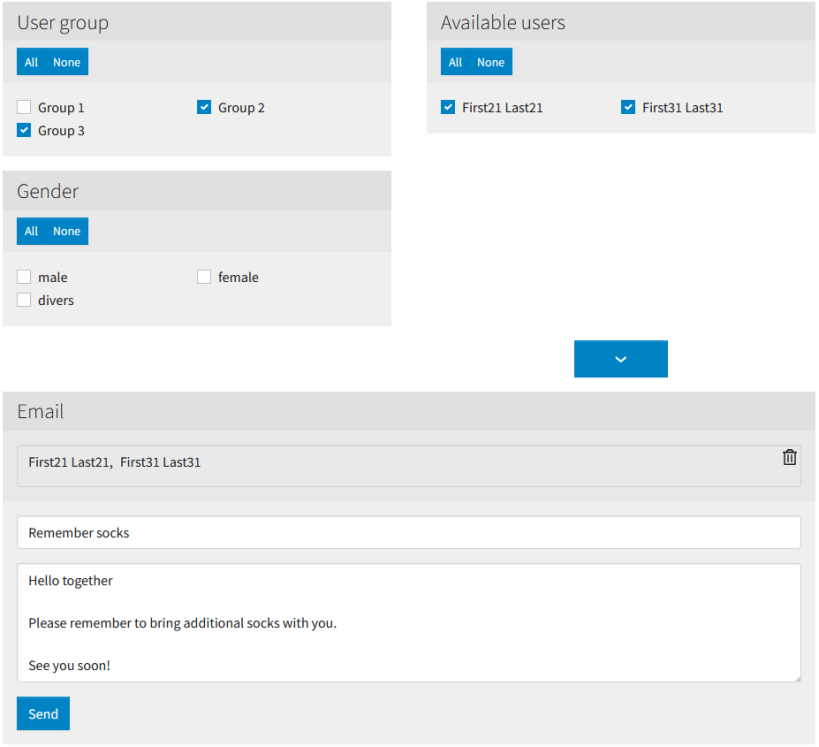

.. image:: https://img.shields.io/badge/TYPO3-11-orange.svg
   :alt: TYPO3 11
   :target: https://get.typo3.org/version/11

.. image:: https://img.shields.io/badge/TYPO3-10-orange.svg
   :alt: TYPO3 10
   :target: https://get.typo3.org/version/10

.. image:: https://github.com/buepro/typo3-fromes/workflows/CI/badge.svg
   :alt: Continuous Integration Status
   :target: https://github.com/buepro/typo3-fromes/actions?query=workflow%3ACI

==========================
TYPO3 extension ``fromes``
==========================

The extension provides a plugin allowing website users to send emails to
other website users by compiling the receiver list with customizable
filters.

While working with the interface the content is updated dynamically without
the page to be reloaded offering a smooth user experience.

Additional filters can be added to obtain receivers depending on third party
extensions.

:Repository:  https://github.com/buepro/typo3-fromes
:Read online: https://docs.typo3.org/p/buepro/typo3-fromes/main/en-us/
:TER:         https://extensions.typo3.org/extension/fromes

Screenshots
===========

Acknowledgement
===============

This extension has been sponsored by `SAC-Sektion Uto <https://www.sac-uto.ch>`__.
